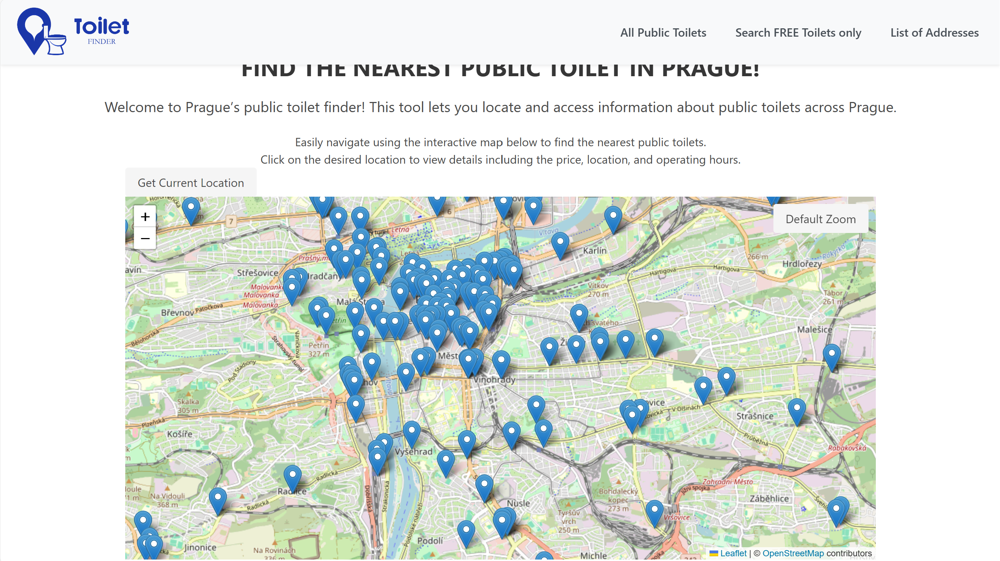

# Public Toilets Finder - Prague, Czech Republic
[https://filipv747.pythonanywhere.com/](https://filipv747.pythonanywhere.com/)

## About The Project
The website takes publicly available data on locations of public toilets in Prague, Czech Republic. Each location is placed on an interactive map using the LeafLet library. It provides valuable information such as price, operating hours, and each location has its own detail page, where people can post their rating of the place.

### Built With
- Python/Django
- HTML
- CSS
- JavaScript

